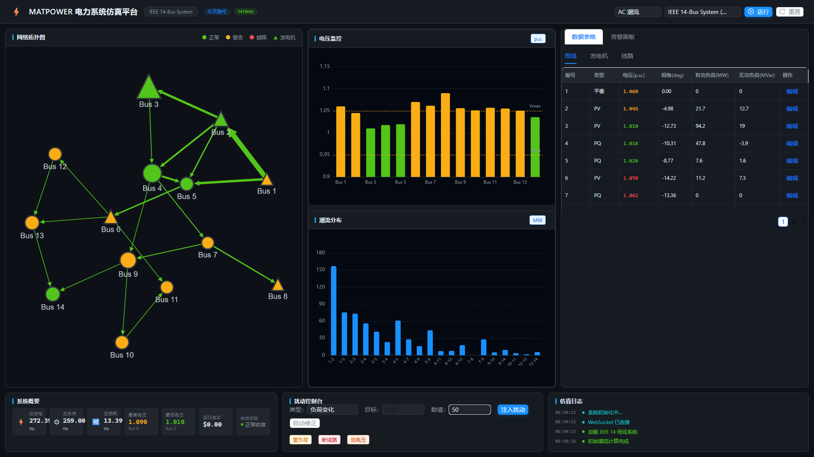
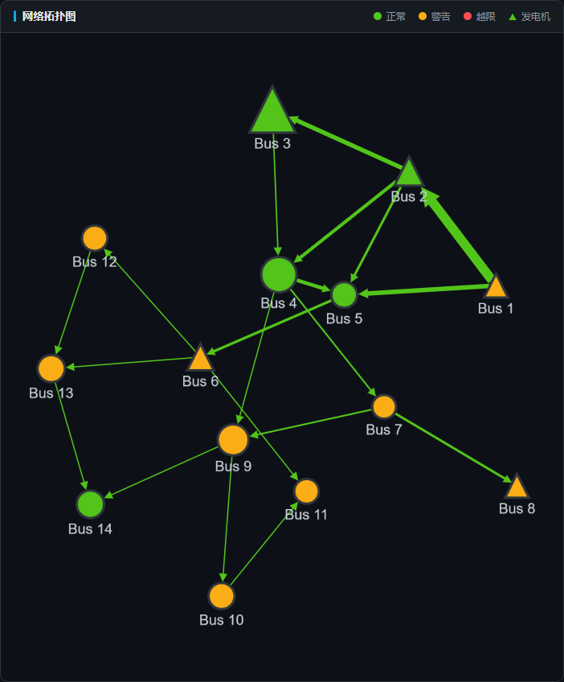
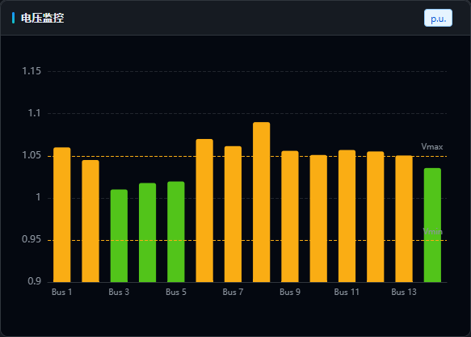
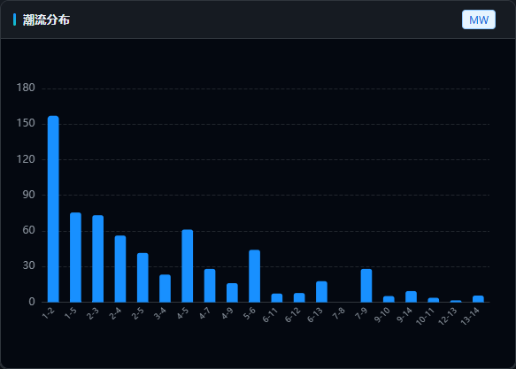
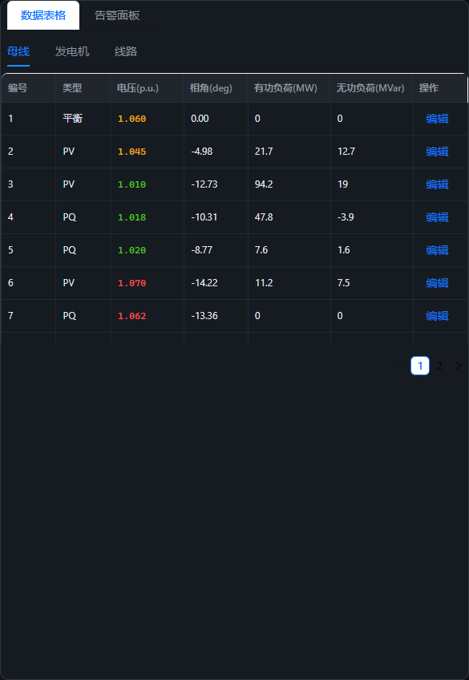
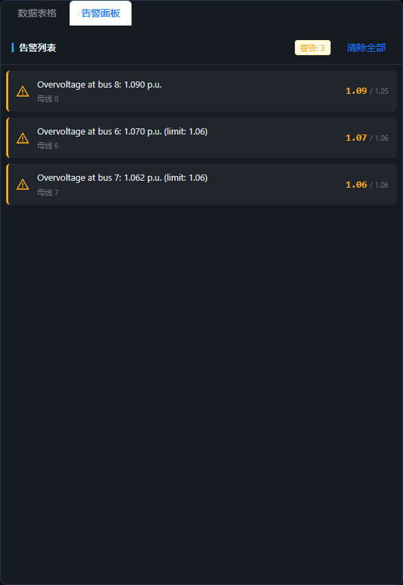

# MATPOWER Web - 电力系统仿真平台

基于 [MATPOWER](https://matpower.org/) 的 Web 可视化电力系统仿真平台，提供潮流计算、最优潮流（OPF）、扰动分析等功能的交互式图形界面。



---

## 功能特性

### 网络拓扑可视化

基于 Cytoscape.js 的交互式电力网络拓扑图，支持缩放、平移和节点点击查看详情。母线按电压着色，发电机用三角形标识，支路显示潮流方向和负载率。断开线路以灰色虚线标识，保留空间位置关系。



### 电压监测

ECharts 柱状图实时展示各母线电压幅值，绿/黄/红三色标识正常、越限和严重状态，带 Vmin/Vmax 参考线。悬浮提示展示详细电压、相角和允许范围。



### 潮流分布

展示各支路有功功率及线路负载率，高负载线路自动标红告警。仅显示在运线路，悬浮提示包含潮流值、容量、负载率和线路损耗。



### 数据表格与在线编辑

提供母线、发电机、支路数据的表格视图，支持在线编辑参数（负荷、电压、线路状态、容量等），编辑后自动重新仿真。编辑模态框带有类型标识和友好的数值输入。



### 告警面板

自动检测电压越限、线路过载等问题，按严重等级（严重/警告）分类展示，告警条目带入场动画和颜色指示，支持一键清除。



### 系统概要与扰动控制

底部面板展示系统总发电/负荷/损耗等关键指标，扰动注入控制台支持负荷变化、线路断开、发电机跳闸、电压调整四种扰动类型，带快速操作标签。仿真日志实时记录系统事件。


---

## 技术栈

| 层级 | 技术 |
|------|------|
| **前端** | Vue 3 + TypeScript + Vite + Ant Design Vue 4 + ECharts 6 + Cytoscape.js |
| **后端** | Python 3.12 + FastAPI + Uvicorn |
| **仿真引擎** | GNU Octave + MATPOWER（子进程调用） |
| **数据库** | SQLite（SQLAlchemy + aiosqlite） |
| **通信** | REST API + WebSocket |

---

## 快速开始

### 环境要求

- **Node.js** >= 18
- **Python** >= 3.10
- **GNU Octave** >= 6.2（需加入系统 PATH）
- **MATPOWER** 8.0+（已挂载到项目路径）

### 1. 安装依赖

```bash
# 后端
cd backend
pip install -r requirements.txt

# 前端
cd ../frontend
npm install
```

### 2. 启动服务

```bash
# 后端（默认端口 8000）
cd backend
python run.py

# 前端（默认端口 5173）
cd frontend
npm run dev
```

或使用一键启动脚本：

```bash
# Windows
start-all.bat

# Linux/macOS
./start-all.sh
```

### 3. 访问应用

- **前端界面**: http://localhost:5173
- **后端 API 文档**: http://localhost:8000/docs
- **健康检查**: http://localhost:8000/health

---

## Docker 部署

```bash
docker-compose up -d
```

生产环境（含 Nginx 反向代理）：

```bash
docker-compose --profile production up -d
```

---

## 支持的仿真类型

| 类型 | 说明 | 算法 |
|------|------|------|
| **AC 潮流** | 交流潮流计算 | Newton-Raphson, Fast Decoupled (XB/BX), Gauss-Seidel |
| **DC 潮流** | 直流潮流计算 | 线性化近似 |
| **最优潮流 (OPF)** | 经济调度优化 | MIPS 等内点法 |

## 测试用例

内置 78 个 MATPOWER 标准测试用例，包括：

| 用例 | 母线数 | 说明 |
|------|--------|------|
| case9 | 9 | IEEE 9 母线系统 |
| case14 | 14 | IEEE 14 母线系统 |
| case30 | 30 | IEEE 30 母线系统 |
| case39 | 39 | IEEE 39 母线系统 |
| case57 | 57 | IEEE 57 母线系统 |
| case118 | 118 | IEEE 118 母线系统 |
| case300 | 300 | IEEE 300 母线系统 |
| ... | ... | 更多用例 |

---

## 扰动分析

支持四种扰动类型的实时注入：

- **线路开断** — 移除指定传输线路
- **发电机开断** — 关停指定发电机
- **负荷变化** — 调整母线负荷（MW/MVAr）
- **电压调整** — 修改电压设定值

支持 N-1 故障分析、蒙特卡洛模拟、灵敏度分析等高级功能。

---

## 项目结构

```
matpower-web/
├── backend/                  # FastAPI 后端
│   ├── app/
│   │   ├── api/routes/       # API 路由（cases, simulation, disturbance, data）
│   │   ├── api/ws.py         # WebSocket 端点
│   │   ├── core/             # 核心逻辑（Octave 引擎）
│   │   ├── db/               # 数据库模型与连接
│   │   ├── models/           # Pydantic 数据模型
│   │   ├── services/         # 业务逻辑层
│   │   └── main.py           # 应用入口
│   └── run.py                # 启动脚本
├── frontend/                 # Vue 3 前端
│   ├── src/
│   │   ├── components/       # UI 组件
│   │   ├── views/            # 页面视图
│   │   ├── stores/           # Pinia 状态管理
│   │   ├── api/              # HTTP/WebSocket API 客户端
│   │   └── router/           # Vue Router 配置
│   └── package.json
├── docs/                     # 文档与截图
├── docker-compose.yml        # Docker 编排
├── start-all.bat / .sh       # 一键启动脚本
└── README.md
```

---

## API 概览

| 模块 | 端点 | 说明 |
|------|------|------|
| **用例管理** | `GET /api/cases` | 列出所有测试用例 |
| | `GET /api/cases/{name}` | 获取用例数据 |
| | `PUT /api/cases/{name}/params` | 修改用例参数 |
| **仿真** | `POST /api/simulation/run` | 异步运行仿真 |
| | `POST /api/simulation/pf` | 潮流计算 |
| | `POST /api/simulation/opf` | 最优潮流 |
| | `POST /api/simulation/n1-analysis` | N-1 分析 |
| **扰动** | `POST /api/disturbance/apply` | 注入扰动 |
| | `POST /api/disturbance/auto-correct` | OPF 自动校正 |
| **数据** | `GET /api/data/simulations` | 仿真记录查询 |
| | `POST /api/data/export/json` | 导出 JSON |
| | `POST /api/data/export/csv` | 导出 CSV |
| **WebSocket** | `/ws/simulation/{client_id}` | 仿真进度推送 |
| | `/ws/events` | 事件广播 |

完整 API 文档请访问 http://localhost:8000/docs。

---

## 更新日志

### v1.1.0 (2026-04-01)

**数据联动修复**
- 修复拓扑图信息面板、数据表格、图表之间数据不同步的问题
- 仿真完成后自动将结果同步回本地数据（电压、相角、潮流、线路状态等）
- 拓扑图信息面板改为从最新仿真结果实时读取，不再使用快照数据

**扰动状态累积**
- 新增修改累积机制（`accumulatedModifications`），多次编辑/扰动的改动会合并保留
- 修复连续断开多条线路时只有最后一次生效的问题
- 断开的线路在拓扑图中以灰色虚线标识，而非直接隐藏

**界面美化**
- 全面改进暗色主题：按钮悬浮上浮、卡片边框发光、滚动条精细调优
- 修复电压监控和潮流分布图表始终为空的问题（v-if 导致 ECharts 容器延迟渲染）
- 编辑模态框重写：带彩色类型标签、友好的数值输入、加载状态提示
- 拓扑信息面板增加滑入/滑出动画，展示更完整的潮流数据
- 告警面板条目增加入场动画和悬浮滑动效果
- 仿真日志增加彩色时间点指示器和入场动画
- 系统概要指标卡片增加悬浮上浮效果

**类型修复**
- 修复 `SimulationControls` 模式类型 `'ac'/'dc'/'opf'` 与 store `'PF'/'DCPF'/'OPF'` 不匹配
- 修复 `SystemSummary` 类型中 `min_voltage`/`max_voltage` 重复定义
- 修复 ECharts init 选项 `backgroundColor` 类型错误
- 修复 Cytoscape `transition-duration` string/number 类型错误

---

## License

BSD-3-Clause
